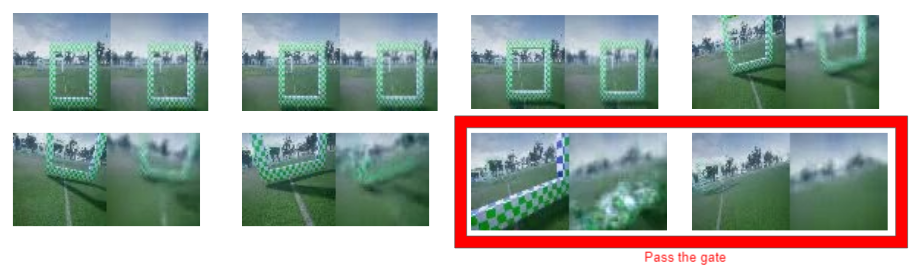

# Airsim-Reinforcement-Approach
- contain the code with airsim env
- Include data collection, VAE training, <!--Behvior clone,--> Model free RL training, and Model-based RL training

## Quick Demo Video
- Demonstration of self-flying drone
    - [](https://youtu.be/tDDw3dRxX3E "Airsim Reinforcement Learning")
- Conditional video frame prediction
    -   
    <!--- [](https://youtu.be/ZNiG8Fy8eLs "")-->


## Environment Setup
- Simulator
    - Use [Airsim Neruips 2020 Game of Drone Envirionment](https://github.com/microsoft/AirSim-NeurIPS2019-Drone-Racing)
    - Please download the **[Training binaries and environments (v0.3)](https://github.com/microsoft/AirSim-NeurIPS2019-Drone-Racing#downloadin)**
- Dependecies
    - Pytorch >= 1.3
    - airsimneurips
    - airsim
    - numpy
- Hardware
    - I test the code on the machine with following hardware components
        - GTX 2080 TI
        - Intel I9 
        - 64 GB ram
<!--
- Algorithm
    - DDPG
    - TD3
    - TD3_lstm
    - Dreamer

- Setting
    - Full information
    - Image
-->
## Script
### Open environment
```
cd <you environment path>
./AirSimExe.sh -windowed -opengl4

```
### Training & Validation
```
# For only validation
python main.py --save_model --env Soccer_Field_Easy --save_model --save_img --load_model=/home/pc3433/aidrone-airsim/Airsim-Dreamer/Weight/pretrain_latent_maxv5_model/TD3_Soccer_Field_Easy_0_ep32650 --name=latent_maxV5 --control_mode=vel_rpyt --validation
# For training
python main.py --save_model --env Soccer_Field_Easy --save_model --save_img --load_model=/home/pc3433/aidrone-airsim/Airsim-Dreamer/Weight/pretrain_latent_maxv5_model/TD3_Soccer_Field_Easy_0_ep32650 --name=latent_maxV5 --control_mode=vel_rpyt 
```
<!--
### Latent + RTD3
```
# For training
python main.py --save_model --env Soccer_Field_Easy --save_model --save_img --name=rnn_latent_maxV5 --control_mode=vel_rpyt --rnn --batch_size=4096
```
-->
